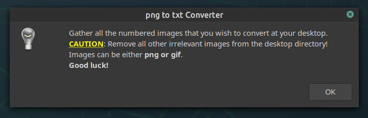
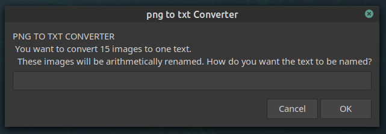
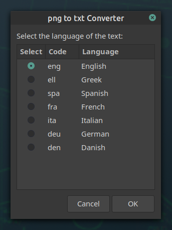
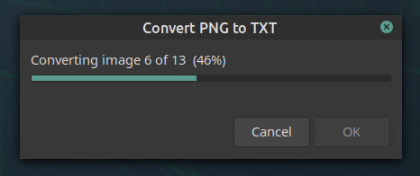
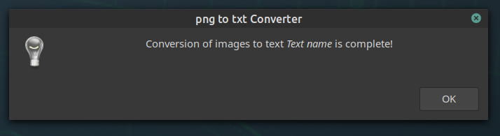

# pngtotxt

Convert images of text(e.g. pages of book, science paper etc) to ONE concatenated .txt file.

pngtotxt is a simple bash script that is based on the **Tesseract Open Source OCR Engine (main repository)**

[https://tesseract-ocr.github.io/](https://tesseract-ocr.github.io/)

[https://github.com/tesseract-ocr/tesseract](https://github.com/tesseract-ocr/tesseract)

### INSTALL

#### DEPENDENCIES

 * tesseract: 
You can either [Install Tesseract via pre-built binary package](https://tesseract-ocr.github.io/tessdoc/Home.html) or [build it from source](https://tesseract-ocr.github.io/tessdoc/Compiling.html).
C++17 support is required for building.  

  *  rename, zenity, imagemagick   
   

     sudo apt install rename zenity imagemagick

### INSTALL

Git clone this repo :

    git clone https://gitlab.com/christosangel/pngtotxt.git

Change directory to pngtotxt:

    cd pngtotxt

Make pngtotxt file executable:

    chmod +x pngtotxt

You may copy this file to your /usr/local/bin  if you like:

    sudo cp pngtotxt/usr/local/bin/

###LANGUAGE SUPPORT

In order to be able to convert images of text in specific languages :

 1. Go to  [this link](https://tesseract-ocr.github.io/tessdoc/Data-Files-in-different-versions.html) to see whether this specific language is supported by tesseract, and if yes,

 1.  Change /add lines to the pngtotxt script (lines 56 to 65), adding name and code of wanted language(s).

### RUN

    $ pngtotxt

###HOW TO USE IT

Gather all the numbered images that you wish to convert at your desktop. 

**CAUTION**: Remove all other irrelevant images from the desktop directory.

Images can be either png or gif.

Run pngtotxt, and you will be welcome with this message:

After you press _Enter_, you will be asked to give the name you wish for the final text:

After naming the final text, you will be asked for the language of the text:

After language selection, the conversion commences:

Finally, you get a message when the conversion is complete:

In the desktop you will find a folder named  by the text name, that will contain:

 1.  The final text .txt file
 2. an image scroll with the images concatenated.
 3. a folder that contains all the png images.
 4. a folder that contains all the txt files from the conversion.

